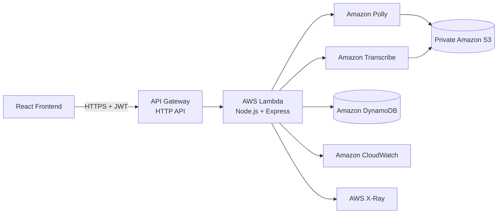

**AWS Serverless Application Model (AWS SAM)** được sử dụng để mô tả, build và triển khai toàn bộ backend Polly Voice. SAM chuyển `template.yaml` thành CloudFormation stack, nhờ đó các tài nguyên có thể được tạo và cập nhật nhất quán.

Kiến trúc backend:



1. Kiểm tra AWS CLI đang đăng nhập đúng tài khoản và đúng region:

```powershell
aws sts get-caller-identity
aws configure get region
```

Account ID phải là tài khoản dùng cho workshop và region phải là:

```text
eu-north-1
```

<!--  -->

{}
Không tiếp tục deploy nếu `aws sts get-caller-identity` trả về tài khoản cũ hoặc
không đúng tài khoản thực hành.
{}

2. Mở PowerShell tại thư mục `backend` và kiểm tra các file triển khai:

```text
backend/
├── src/
│   ├── app.ts
│   ├── lambda.ts
│   ├── modules/
│   ├── infrastructure/
│   └── security/
├── package.json
├── package-lock.json
├── template.yaml
└── tsconfig.json
```

<!--  -->

3. Cài dependencies và kiểm tra source:

```powershell
cd backend
npm ci
npm run typecheck
npm test
```

`npm ci` sử dụng `package-lock.json` để tạo dependency tree có thể lặp lại.
Typecheck và test được thực hiện trước khi đóng gói Lambda.

<!--  -->

4. Kiểm tra SAM template:

```powershell
sam validate
```

`template.yaml` khai báo:

- Lambda runtime Node.js 22, kiến trúc arm64.
- API Gateway HTTP API.
- DynamoDB table sử dụng on-demand billing.
- Private S3 media bucket.
- Lambda environment variables.
- IAM policy cho Polly, Transcribe, S3 và DynamoDB.
- CloudWatch Logs và X-Ray tracing.

<!--  -->

5. Build Lambda package:

```powershell
sam build --no-cached
```

SAM sử dụng esbuild với entry point:

```text
src/lambda.ts
```

Build thành công tạo artifact trong:

```text
backend/.aws-sam/build/
```

<!--  -->

{}
Nếu SAM báo không tìm thấy esbuild, chạy `npm install` trong thư mục backend và
kiểm tra `esbuild` tồn tại trong `devDependencies`.
{}

{}
Nếu Windows báo `Access is denied` khi SAM xử lý thư mục tạm, hãy đóng tiến trình
đang giữ file, chuyển project ra khỏi thư mục đang đồng bộ OneDrive nếu cần và
chạy lại `sam build --no-cached`.
{}

6. Chuẩn bị các parameter cần thiết:

| Parameter | Giá trị |
|---|---|
| Stack name | `polly-voice-api` |
| Region | `eu-north-1` |
| MediaBucketName | `polly-voice-media-<ACCOUNT_ID>-eu-north-1` |
| HistoryTableName | `polly-voice-history` |
| CognitoUserPoolId | User Pool ID của Cognito |
| CognitoClientId | SPA App Client ID |
| AllowedOrigins | `http://localhost:5173` trong lần deploy đầu |
| TranscribeLanguageCode | `en-US` |

{}
**Note**
Tên S3 bucket phải duy nhất trên toàn cầu. Việc thêm **Account ID** giúp giảm khả năng trùng tên.
{}

<!--  -->

7. Thực hiện lần deploy đầu tiên:

```powershell
sam deploy --guided --capabilities CAPABILITY_IAM
```

Nhập các parameter đã chuẩn bị. Với các câu hỏi xác nhận, sử dụng:

```text
Confirm changes before deploy: Y
Allow SAM CLI IAM role creation: Y
Disable rollback: N
Save arguments to configuration file: Y
```

`CAPABILITY_IAM` xác nhận rằng CloudFormation được phép tạo Lambda execution
role từ policy trong SAM template. Lambda không được cấp `AdministratorAccess`.

<!--  -->

8. Trước khi tạo tài nguyên, SAM hiển thị CloudFormation change set. Kiểm tra
danh sách resource và xác nhận triển khai.

Các resource chính:

```text
AWS::Serverless::HttpApi
AWS::Serverless::Function
AWS::S3::Bucket
AWS::DynamoDB::Table
AWS::IAM::Role
```

<!--  -->

9. Chờ CloudFormation hoàn tất. Stack phải có trạng thái:

```text
CREATE_COMPLETE
```

SAM hiển thị Outputs:

```text
ApiUrl
FunctionName
MediaBucket
HistoryTable
```

<!--  -->

<!--  -->

10. Ghi lại `ApiUrl` trong:

```text
AWS CloudFormation
→ Stacks
→ polly-voice-api
→ Outputs
```

URL có dạng:

```text
https://<API_ID>.execute-api.eu-north-1.amazonaws.com
```

Frontend sử dụng:

```text
https://<API_ID>.execute-api.eu-north-1.amazonaws.com/api/v1
```

<!--  -->

## Quyền để Lambda gọi các dịch vụ AWS

SAM tạo execution role cho Lambda từ phần `Policies`:

```yaml
Policies:
  - DynamoDBCrudPolicy:
      TableName: !Ref HistoryTable
  - S3CrudPolicy:
      BucketName: !Ref MediaBucket
  - Statement:
      - Effect: Allow
        Action:
          - polly:SynthesizeSpeech
          - polly:DescribeVoices
          - transcribe:StartTranscriptionJob
          - transcribe:GetTranscriptionJob
          - transcribe:DeleteTranscriptionJob
        Resource: "*"
```

AWS SDK trong Lambda tự nhận temporary credentials của execution role. Project
không lưu access key hoặc secret access key trong source và environment
variables.

## Kết quả

Backend đã được triển khai dưới dạng CloudFormation stack. API Gateway HTTP API,
Lambda, private S3 bucket và DynamoDB table được tạo tại `eu-north-1`. Outputs
của stack cung cấp các giá trị cần thiết để kiểm tra backend và kết nối
frontend.
